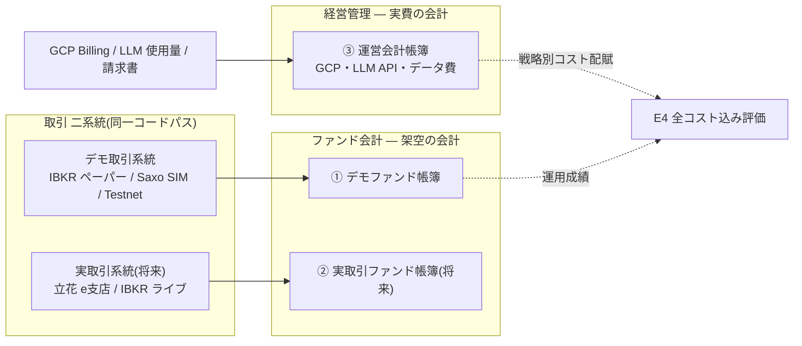
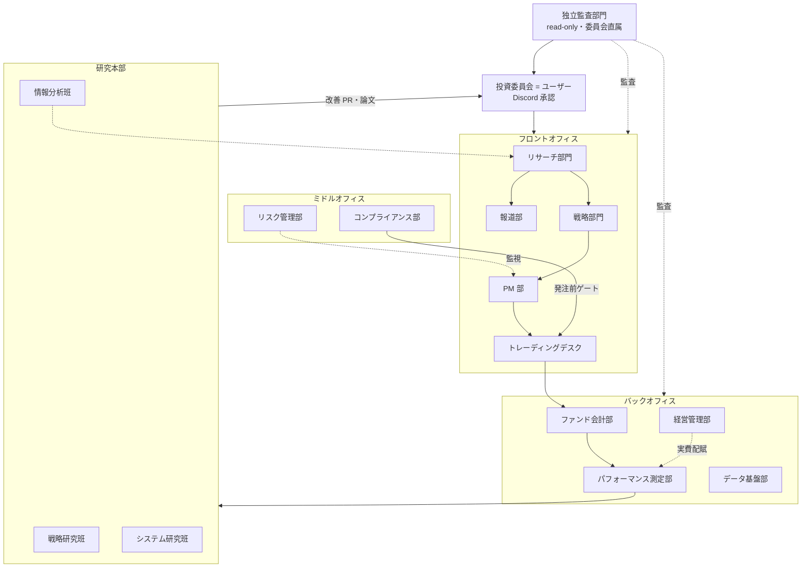
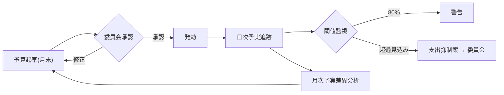
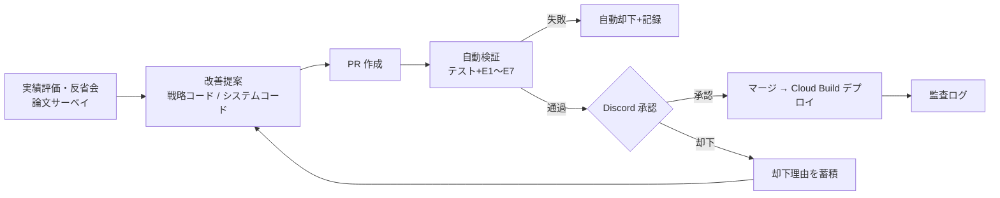
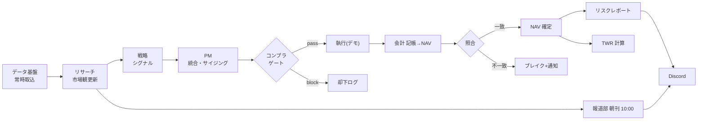
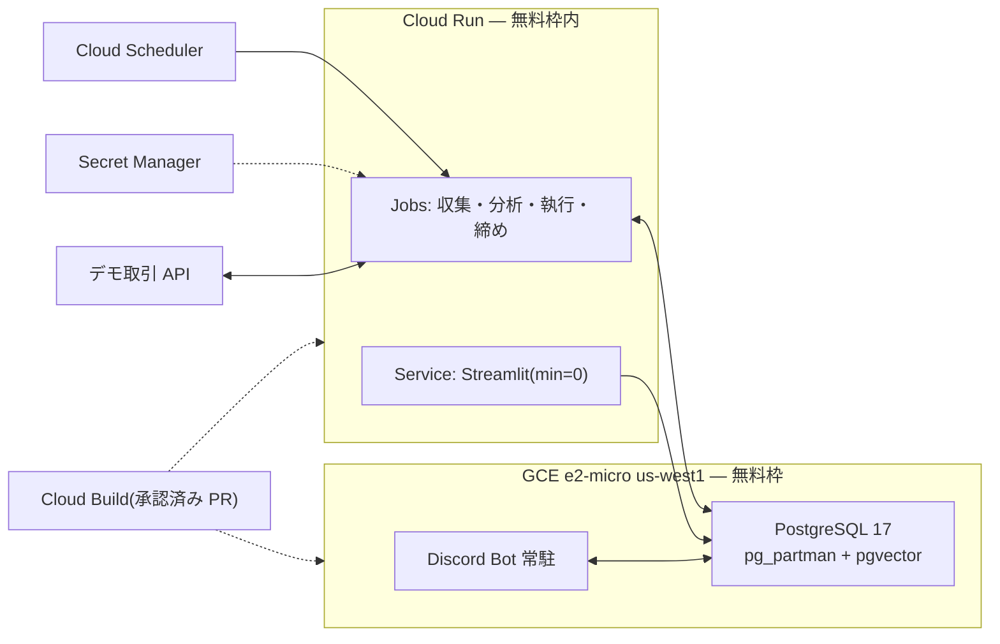

# Ryza 全体システム設計書 v3.2

- ステータス: v3.2 ドラフト(ユーザーレビュー待ち)
- v3.2 の主変更: 執筆規格の制定(`70-writing-standard.md`・保護領域)/ Fable の研究ノルマ1日1本
- 更新日: 2026-08-02
- 本書が正(mermaid 図入り・自己完結)。根拠資料: `docs/research/` の5本
- v3 の主変更: 会計二系統(ファンド会計/運営会計)・証憑必須・財務三表・月次予算フロー・独立監査部門・研究本部3班・報道部・用語定義の整備
- v3.1 の主変更: 経済新聞部→**報道部**に改称(最大5トピック・各アブストラクト分量・アニメ画像embed・個別銘柄推奨OK)/**稼働モデルを随時稼働基本に改訂**(サイクル列は成果物の締めを示す)/**階層0(非LLM: ルール・古典ML)を新設**し分類・抽出は LLM を使わない/**データ基盤部の責務拡張**(全使用・生成データのリネージ追跡、データカタログ、pgvector ベクトル検索基盤)

## 0. 基本構造(最重要)

**取引は二系統**: デモ取引系統(当面はこちらのみ。IBKR ペーパー/Saxo SIM/Testnet)と実取引系統(将来。立花 e支店/IBKR ライブ)。同一コードパス、アダプタと設定のみで分離。

**会計は二系統・帳簿3エンティティ(book_id で完全分離、混合はスキーマ制約で禁止)**:
1. デモファンド帳簿(架空)— 仮想資金の複式簿記
2. 実取引ファンド帳簿(将来)— 実弾開始時に新設、①から引き継がない
3. 運営会計帳簿(実費)— GCP・LLM API・データ費・手数料等、実際のお金

E4(全コスト込み評価)は、③の実費を戦略・部門別にタグ付け配賦し評価時に①と結合(デモ帳簿にみなし記帳はしない)。

## 1. 用語定義(評価プロトコル E1〜E7)

- **E1 カットオフ後評価**: LLM 関与戦略の過去検証は使用モデルの学習カットオフ後の期間のみ(期間内の好成績は記憶の再生。統制で最大 -71.85% の実証)
- **E2 前向き検証**: 採用の最終判断はペーパートレードの前向き検証
- **E3 ベースライン対照**: 等配分 buy-and-hold にコスト込みで勝てない戦略は不採用
- **E4 全コスト込み**: 手数料・スリッページ+LLM トークン費・データ費込みの純損益で評価(運営会計から配賦)
- **E5 分散の報告**: 複数シード実行でばらつきを報告。短期 Sharpe 差で意思決定しない
- **E6 point-in-time ユニバース**: その時点で選べた銘柄群で検証(生存者バイアス排除)
- **E7 単一エージェント対照**: マルチエージェント構成は単一構成との対照比較後に採用
- **E8 資本スケール&開始時点スイープ**(2026-08-02 追加): 全戦略評価は初期資本のグリッド(¥10万・30万・50万・80万・100万)×複数の開始時点(ローリング)で実行し、成績が特定の資本規模・開始タイミングに依存しないことを確認する。売買単位(日本株100株)・最低手数料・端数制約は資本規模ごとに現実どおり適用する(小資本では実行可能ユニバース自体が変わるため)。ペーパー運用でも資本規模の異なる仮想帳簿を並走させてよい

その他: as_of(情報が利用可能になった時点)/ NAV / TWR / VaR・ES / ウォークフォワード / IPS(投資方針書=憲法、人間のみ起票可)/ HITL / 証憑 / ブレイク / シャドー会計 / TCA — 詳細は Artifact §02。

## 2. 設計原則(v1 から継続)

1. LLM は判断材料を作る側。お金を動かす経路(シグナル合成→サイジング→ゲート→執行→会計)は決定論
2. コンプライアンスゲートが唯一の発注経路
3. 全データ as_of 付き不変保存、分析は point-in-time
4. 判断来歴の全保存
5. モジュール間はデータ契約のみで疎結合
6. 最小構成+移行路の確保

## 3. 組織(14部門)

稼働モデルは**随時稼働(イベント駆動)が基本**。下表「サイクル」列は成果物の締め・報告のチェックポイントを示す。

| 部門 | 責務 | 成果物 | サイクル |
|---|---|---|---|
| 投資委員会(=ユーザー) | IPS・政策・予算・戦略昇格・PR・監査対応の承認。緊急停止 | 決議(議事録) | 随時+四半期定例 |
| AI 役員(CIO/独立役員ペルソナ) | 経営レベルの起草と批判([05-governance.md](05-governance.md))。役職資産(charter+永続記憶)としてセッション非依存で永続化 | IPS 批判レポート、独立役員意見書、議事録 | 四半期+臨時 |
| 独立監査部門 | 全部門の独立監査(§7)。委員会直属・read-only・別実行環境 | 月次監査報告、指摘トラッカー | 月次+四半期 |
| リサーチ部門(LLM×4) | 常時の情報蓄積と「市場観ステート」の継続更新 | research_reports、市場観ステート | 常時稼働 |
| 報道部 | アナリスト見解の執筆(規定文体・最大5トピック)、速報判断 | 朝刊(10:00 JST)、速報 | 常時監視/定時投稿 |
| 戦略部門 | ストラテジー動物園(手法ライフサイクル) | signals、週次手法評価 | 日次+週次 |
| PM 部 | 政策ウェイト・乖離幅管理、統合、サイジング | モデルポートフォリオ、order_intents | 日次 |
| トレーディングデスク | 最良執行(デモ/実の二系統・同一コードパス) | executions、TCA | 発注都度 |
| リスク管理部 | VaR/ES・エクスポージャー・リミット・ストレス | 日次リスクレポート | 日次+月次 |
| コンプライアンス部 | 発注前ゲート+新聞投稿の表現チェック | pass/warn/block+監査ログ | 都度 |
| ファンド会計部 | 取引の複式簿記(帳簿①②)、NAV、照合 | 仕訳帳・試算表・BS/PL、日次 NAV、ブレイク | 日次締め |
| 経営管理部 | 実費会計(帳簿③)、月次予算編成・予実管理、LLM コスト監視 | 運営 BS/PL/CF、予算書、予実差異分析 | 日次+月次 |
| パフォーマンス測定部 | TWR・Brinson・エージェント/戦略貢献度 | 月次レポート | 日次+月次 |
| データ基盤部 | 全使用・生成データのリネージ追跡と確実な保存、point-in-time 収集、証憑ストア、カタログ、ベクトル検索 | bars/documents/evidence、リネージグラフ、カタログ | 常時取込 |
| 研究本部(3班) | 戦略研究(論文級)・情報分析(常時)・システム研究 | 研究論文、テーマレポート、改善 PR | 常時稼働/Fable タスクのみ週次 |

## 4. ファンド会計部(強化)

- **証憑必須**: 全仕訳行に evidence_id NOT NULL。証憑(約定 API レスポンス原文+ハッシュ、価格スナップショット参照、GCP Billing Export 行、請求書)は証憑ストアに不変保存
- **財務諸表の常時閲覧**: 試算表(日次)、BS(日次/月次)、PL(月次/累計)、CF(月次)、運用報告書(月次)を帳簿エンティティ別に自動生成、ダッシュボード常設+月次 Discord 配信
- 記帳原則: 約定日ベース、実現/未実現分離、発生主義、日次締め→照合→一致で NAV 確定/不一致でブレイク管理

## 5. 経営管理部(新設)— 月次予算サイクル

予算起草(月末・科目別見積: GCP/LLM モデル階層・部門別/データ費)→ Discord 承認 → 日次予実追跡(Billing Export・使用量 API 自動取込)→ 閾値監視(80% 警告、100% 超過見込みで支出抑制案を委員会へ)→ 月次予実差異分析 → 翌月へ。全 LLM 呼び出しに部門・タスク種別タグ必須。

## 6. 独立監査部門(新設)

独立性: 別実行環境(別 Cloud Run ジョブ・別サービスアカウント)、read-only 権限、投資委員会直属報告、本体と別系統のモデル/プロンプト。監査部門のコードは保護領域(R&D の PR 対象外)。

監査項目: A-1 仕訳と証憑の突合 / A-2 照合状況とブレイク滞留 / A-3 ゲート迂回検知(executions×ゲートログ突合)/ A-4 リスクリミット遵守 / A-5 承認ログ完全性 / A-6 E1〜E7 遵守 / A-7 帳簿分離の維持 / A-8 予算執行の妥当性 / A-9 保護領域の変更管理 / A-10 as_of 整合(point-in-time 違反検知)。A-1〜A-5 は実弾移行の前提条件。

## 7. 報道部(新設・v3.1 改称)

- 毎朝 **10:00 JST** に朝刊を Discord 投稿。**報道価値のあるアーギュメント単位で最大5トピック、各トピックは論文アブストラクト程度の分量(目安200〜400字)**。構成: トピック群(各: 一文アーギュメント+U字本文)→ 本日の注目 → ポートフォリオ概況
- **文体規定**: センテンス抽象度5段階(1=純粋なファクト、2=観察、3=概念的まとめ、4=方向付け、5=アブストラクト・アーギュメント)。パラグラフは 4→3→2→1→3→5 の U字が理想形。執筆エージェントが文ごとに抽象度タグを出力し、決定論的リンターが U字形状と「レベル1の文の出典紐付け」を検査、不合格は再生成
- **embed 仕様**: リッチ embed+**アニメの女の子の画像**(生成 or ライセンスクリアな自前アセットのローテーション)。速報は embed 色を赤に
- **速報**: ①緊急ニュース(即時)②報道前の予兆(複数の弱いシグナルの同方向一致。確度・根拠明記で事実と区別、事後検証で予兆精度を評価)。監視は GCE 常駐+場中定期ジョブ(階層0の異常検知→軽量→中位のエスカレーション)
- **表現ルール(v3.1)**: 完全非公開サーバーのため**個別銘柄の売買推奨表現は許可**。コンプライアンス部のチェックは「非公開設定の維持」と「推奨の根拠(出典)の存在」に変更。公開範囲拡大時のみ制限復活フラグ

## 8. 研究本部(3班+モデル階層)

- **戦略研究班**: Fable が仮説生成・研究設計 → E1〜E7 バックテスト → 論文形式で蓄積(プレプリント級品質目標)。有望なら戦略部門へ採用申請。**Fable のノルマは1日1本**(仮説キュー・データ準備・バックテストはパイプラインが常時供給)
- **執筆規格(v3.2)**: 価値あるすべての文章は `docs/design/70-writing-standard.md`(保護領域)に従う — 3部構成、モデル論文計測による型習得、Uneven U(4→3→2→1→3→5)、引用の数値管理と必須文献(モデル論文2本共通引用)、イントロの順番(冒頭→先行研究→アーギュメント複数回パラフレーズ→シノプシス)、結論の型(応用可能性+4類型)。リンターで機械検査
- **情報分析班**: ニュース・決算公告・中銀/政府発表・政策・法案・裁判・社会情勢・Reddit・5ch(旧2ch)等の分析研究。シグナル候補とテーマレポートを供給
- **システム研究班**: データ基盤の研究(収集対象・スキーマ)+組織構造自体の研究(部門編成・エージェント構成・承認フロー)
- **モデル階層ポリシー(v3.1 改訂)**: **階層0=非LLM**(ルール・正規表現・古典ML: ロジスティック回帰/勾配ブースティング/fastText の分類、埋め込み+近傍法の重複排除、統計的異常検知)を最優先し、済むなら LLM を使わない/軽量 LLM=非LLMで精度が出ない処理のみ/中位(Opus・zlm 級)=日常分析・実装・執筆/Fable=研究設計・仮説生成・論文執筆・重要レビュー(週次少量)。エスカレーション規則付き。消費は経営管理部が予算管理
- **自己改変ループ**: 提案は PR → 自動検証 → Discord 承認 → Cloud Build デプロイ。保護領域(ゲート・リミット・Kill Switch・会計・監査)は二重確認、IPS は人間のみ

## 9. フロント・ミドル(v2 から継続)

マルチアセット共通モデル+ブローカー抽象化 / リスクエンジン(EWMA+Ledoit-Wolf、ヒストリカル VaR/ES 95%+パラメトリック併算、デルタ調整4集計、GPIF 型2階建て乖離幅、マージン監視、月次ストレス6本、FF 回帰ベット検知)/ ストラテジー動物園(孵化→ペーパー隔離→昇格→調整→退役)

日次業務サイクル(全部門連携):

## 10. GCP デプロイ(v2 +追加)

GCE e2-micro 無料枠(Bot+PostgreSQL+pg_partman+pgvector 同居)+ Cloud Run Jobs/Scheduler + Streamlit(min=0)= 月額 $0〜数ドル。v3 追加: Billing Export(BigQuery)有効化(実費記帳の一次証憑)、監査用の別サービスアカウント(read-only)、証憑ストア(Cloud Storage、ハッシュ改竄検知)。

v3.1 追加:
- **データリネージ**: 全取込データ・生成物(レポート・シグナル・注文・記事)に「生成ジョブ・コードバージョン・入力データ参照・as_of」を記録。任意の成果物から原データまで遡れるリネージグラフを維持(判断来歴はこの上に載る)
- **データカタログ**: 全テーブル・データセットの説明・スキーマ・鮮度をダッシュボードに常設
- **ベクトル検索**: テキスト系の埋め込みは pgvector(Postgres 内のベクトルDB)。数百万件超で Qdrant 等への移行路
- **常時稼働**: GCE 常駐プロセス(取込・監視・市場観更新・Bot)+イベント駆動 Cloud Run ジョブ。随時稼働の主体は階層0(非LLM)なのでコスト増なし

## 11. 次のステップ

1. IPS の起草(ユーザーと対話で決定)
2. 会計・データ基盤の詳細設計(3帳簿の勘定科目表・仕訳/証憑スキーマ・財務諸表生成、データ契約8種)
3. 朝刊テンプレート詳細設計(文体リンター仕様・速報判定閾値)
4. 監査手順書(A-1〜A-10)
5. ユーザー作業: IBKR 口座申請、Alpaca/Saxo developer 登録、GCP プロジェクト+Billing Export
6. 実装指示書の発行(中位モデルへ委譲)
