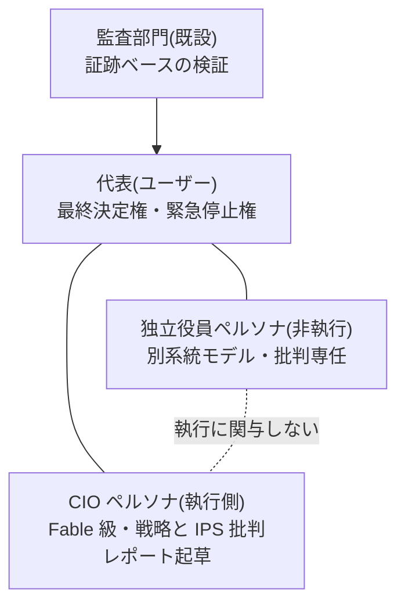

# ガバナンス設計 — AI 役員体制と人格の永続化 v1.0

- 作成日: 2026-08-02 / ステータス: ドラフト(ユーザーレビュー待ち)
- 上位文書: [00-system-design.md](00-system-design.md)
- 参照した実在の制度: 会社法の機関設計(取締役会・監査役)、コーポレートガバナンス・コード(独立社外取締役・取締役会実効性評価)、IIA 3ラインモデル、日本の「三様監査」(内部監査・監査役監査・会計監査人監査)、金商法の内部統制報告(J-SOX)

## 1. 解くべき問題

IPS 批判や経営対話を「開発セッション中の AI」に依存させると、セッション終了とともに継続性が失われる。実在の会社はこの問題を**役職の制度化**で解いている: 役職(取締役・監査役)は定款と規程で定義され、議事録と文書が記憶を担い、担当者は交代可能。Ryza もこれに倣う。

## 2. 原則: 人格は「役職資産」として永続化する

AI 役員の「人格」をセッションではなく、リポジトリ+DB 上の**役職資産**として定義する:

| 役職資産の構成要素 | 実装 | 会社での対応物 |
|---|---|---|
| 職務規程(charter) | `personas/<役職>/charter.md` — 権限・責務・行動規範・利益相反の禁止 | 定款・職務権限規程 |
| 人格プロンプト | `personas/<役職>/system.md` — 口調・思考様式・重視する価値 | (人の個性に相当) |
| 永続記憶 | DB `governance.minutes`(議事録)+ `governance.stances`(過去の主張・懸念の要約) | 議事録・引継書 |
| 知識アクセス | リポジトリ文書+帳簿・リスク・パフォーマンス DB への読み取り(RAG) | 社内文書へのアクセス権 |
| モデル指定 | 役職ごとに使用モデル階層と**系統**を指定 | 担当者の任命 |

セッションは毎回使い捨てでよい。起動時に役職資産を読み込んだ Fable 級モデルが「その役職に着任」する。モデルが世代交代しても役職資産が継続性を担保する(担当者交代と同じ)。

## 3. 役員構成(機関設計)

| 役職 | 担い手 | 責務 | 実在の対応物 |
|---|---|---|---|
| **代表** | ユーザー | IPS・政策・予算・昇格・システム変更の最終決定。緊急停止 | 代表取締役/株主 |
| **CIO ペルソナ** | Fable 級(執行側) | 運用戦略の統括、月次 IPS 批判レポートの起草(80-ips.md §2.1 の月次制に整合 — 2026-08-03 改訂)、代表との対話窓口、研究本部の統括 | 執行役員(CIO) |
| **独立役員ペルソナ** | **執行側と別系統のモデル・別プロンプト資産** | 批判専任: IPS・戦略昇格・重要 PR への異議・少数意見の提出。執行業務を一切持たない。「賛成しかしない独立役員」を防ぐため、**毎回必ず最低1つの懸念事項の提出を義務付ける** | 独立社外取締役(CG コード原則4-7) |
| **監査部門**(既設) | 別実行環境・read-only | 業務監査(A-1〜A-10、証跡ベース)+**実装監査(A-11〜A-12、コード・仕様のバグ発見。別ベンダー AI 推奨)**。自己改変が続く限り恒久機能 | 内部監査+監査役+システム監査(三様監査の簡易形) |

**牽制の設計(3ラインモデルとの対応)**: 1線=フロント(PM・執行)/2線=リスク・コンプライアンス/3線=監査部門。これに**役員層の牽制**(CIO の提案を独立役員が批判し、代表が決める)を重ねる。CIO が自分の設計を自分だけで批判する構造(自己批判の限界)を、系統の異なる独立役員で補う。

## 4. 会議体と議事録

| 会議体 | 頻度 | 出席 | 内容 |
|---|---|---|---|
| **投資委員会(定例)** | 月次 | 代表+CIO+独立役員 | CIO の IPS 批判レポート → 独立役員の意見書 → 対話 → 決議 |
| **経営会議** | 月次 | 代表+CIO(+監査報告) | 予実・パフォーマンス・監査指摘・ストレステスト |
| **臨時委員会** | トリガー時 | 同上 | DD 15%・監査 critical・レジーム激変・重要 PR |
| **ガバナンス実効性評価** | 年次 | 全員+システム研究班 | この統治構造自体の見直し(CG コードの取締役会実効性評価に倣う)。組織構造の研究(研究本部)と接続 |

- **議事録は必須**。全対話を `governance.minutes` に保存し、**発効する決定は「決議」として明示的にマークされたもののみ**(雑談が政策にならないための境界)。決議は証憑となり監査 A-5 の対象
- 各役職の過去の主張は `governance.stances` に要約蓄積され、次回セッションの着任時に読み込まれる(「前回私はこう懸念した」が引き継がれる)

## 5. 対話チャネル(Web UI)

ダッシュボード(Streamlit)に**「役員室」タブ**を設ける:

- **会議形式**(2026-08-03 代表指示。従来は役職を選ぶ1対1チャット): 代表が発言すると、出席役職が固定順(CIO → 独立役員 → 監査)で逐次応答する。裏側は「役職資産+RAG+当該役職のモデル」で応答する LLM。各役員には**当該会議のトランスクリプト全文**(代表+先行役員の発言)を渡し、後の発言者は前の発言を踏まえて議論する(§3 の牽制構造 — CIO の提案を独立役員が批判する — をそのまま発言順に写す)
  - 共有されるのは当該会議の発言のみ。永続記憶(`stances`)・着任プロンプト・盲検レビューは従来どおり役職別に分離する(§6-2 の例外ではなく、その範囲外 — 会議体の審議は発言の共有が本質)
  - 追加すべき論点がない役員は「(発言なし)」でパスできる(同意の繰り返しを求めない)。パスも議事録・UI に残す(発言機会があった証跡。§6-5 の「懸念ゼロ回答の連続」を後から検証するため)。ただし独立役員は重要決定を含む議題では必ず懸念か反対視点を1つ以上出す(§3 の応答義務)
- 会話は自動で議事録候補として保存。「決議」ボタンで正式決定に昇格(代表のみ押せる)
- Discord の承認フロー(日常の HITL)とは役割分担: **Discord=日常の承認・通知、役員室=経営レベルの対話・審議**
- 実装コスト: チャット時のみモデルを呼ぶオンデマンド課金。定例レポートはバッチ。予算科目「役員(Fable)」で管理

## 6. 健全性のためのルール(実務からの移植)

1. **執行と監督の分離**(会社法の機関設計): 代表は日常執行に介入せず(Kill Switch と決議のみ)、システムは決議なしに方針を変えない
2. **独立性の実質確保**(CG コード): 独立役員は執行側とモデル系統・プロンプト資産・記憶を共有しない。報酬(=評価関数)も分離 — 独立役員の評価は「指摘の的中率」であり運用成績ではない
3. **文書化と証跡**(J-SOX の精神): 決議・反対意見・却下理由まで全部残す。「なぜそうしたか」を後から監査できない決定は無効
4. **利益相反の管理**: CIO ペルソナは自分が起草した提案の承認に関与できない(起草と決定の分離)
5. **形骸化の防止**: 独立役員の「懸念ゼロ回答」の連続、決議の付議なし期間の長期化は、それ自体を監査アラート対象とする

## 7. 実装フェーズ

1. 役職資産の作成(personas/ ディレクトリ+charter 2本)と governance スキーマ(minutes / stances)— 設計は本書、実装タスクは別途発行
2. 役員室チャット(Streamlit タブ)— ダッシュボード実装時に同梱
3. それまでの暫定運用: 本開発セッション(Claude Code)の Fable が CIO 役を暫定兼務する。ただし全ての経営対話の結論はリポジトリ文書と議事録ファイル(`docs/minutes/`)に残し、セッションに依存する記憶を残さない
