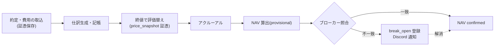

# データ基盤+会計 詳細設計書 v1.0

- 作成日: 2026-08-02 / ステータス: ドラフト(ユーザーレビュー待ち)
- 上位文書: [00-system-design.md](00-system-design.md) v3.2
- 対象: PostgreSQL のスキーマ設計(市場データ・文書・リネージ・証憑・3帳簿・予算・監査)。実装指示書の直接の元になる

## 1. スキーマ全体像

PostgreSQL 17 を5スキーマに分割する。スキーマ間の参照は「下→上」のみ許可(会計は市場データを参照できるが逆は不可):

| スキーマ | 内容 | 書き込み権限 |
|---|---|---|
| `market` | 銘柄マスタ・時系列・指標 | データ基盤部ジョブのみ |
| `docs` | 文書・埋め込み・市場観 | データ基盤部・リサーチ部門 |
| `trade` | シグナル・注文・約定・判断来歴 | 戦略〜執行の各モジュール |
| `ledger` | 3帳簿・証憑・照合・予算 | 会計エンジンのみ(他は SELECT) |
| `meta` | リネージ・ジョブ実行・監査・提案 | 各ジョブ(追記のみ) |

共通原則:
- **追記オンリー**(UPDATE 禁止が基本。訂正は逆仕訳・新バージョン行で表現)
- 全テーブルに `as_of`(情報が利用可能になった時点)と `ingested_at`(取込時刻)
- 生成物には `run_id`(meta.runs への参照)— これがリネージの鍵

## 2. market スキーマ

```sql
-- 銘柄マスタ(SCD2: 履歴保持)
CREATE TABLE market.instruments (
  instrument_id   bigint GENERATED ALWAYS AS IDENTITY,
  symbol          text NOT NULL,            -- '7203.T', 'AAPL', 'USD/JPY', 'BTC-PERP'
  asset_class     text NOT NULL,            -- equity|etf|future|option|fx|crypto|bond
  venue           text NOT NULL,            -- TSE|NASDAQ|SAXO|DERIBIT|BINANCE_TESTNET...
  currency        text NOT NULL,
  multiplier      numeric NOT NULL DEFAULT 1,
  tick_size       numeric,
  margin_params   jsonb,                    -- 証拠金率・維持率等(資産クラス別)
  valid_from      timestamptz NOT NULL,
  valid_to        timestamptz,              -- NULL=現行
  PRIMARY KEY (instrument_id, valid_from)
);

-- 時系列バー(pg_partman で月次パーティション)
CREATE TABLE market.bars (
  instrument_id  bigint NOT NULL,
  ts             timestamptz NOT NULL,      -- バーの時刻
  timeframe      text NOT NULL,             -- 1d|1h|5m ...
  open           numeric, high numeric, low numeric, close numeric,
  volume         numeric,
  source         text NOT NULL,             -- jquants|ibkr|saxo|binance_testnet
  as_of          timestamptz NOT NULL,      -- このデータを知り得た時点
  run_id         bigint NOT NULL,
  PRIMARY KEY (instrument_id, timeframe, ts, source, as_of)
) PARTITION BY RANGE (ts);

-- 指標(マクロ統計・派生指標)
CREATE TABLE market.indicators (
  series_code  text NOT NULL,               -- 'JP_CPI', 'US_10Y', 'PORTFOLIO_VOL' ...
  ts           timestamptz NOT NULL,
  value        numeric NOT NULL,
  revision     int NOT NULL DEFAULT 0,      -- 統計の改定に対応
  as_of        timestamptz NOT NULL,        -- 発表時点(改定は as_of が進む)
  run_id       bigint NOT NULL,
  PRIMARY KEY (series_code, ts, revision)
);
```

**point-in-time クエリ規約**: 分析・バックテストは必ず `WHERE as_of <= :knowledge_time` を通す。専用ビュー `market.bars_asof(:t)` を提供し、生テーブルへの直接クエリはリサーチ・戦略コードでは禁止(監査 A-10 の検査対象)。

## 3. docs スキーマ

```sql
CREATE TABLE docs.documents (
  doc_id        bigint GENERATED ALWAYS AS IDENTITY PRIMARY KEY,
  source_type   text NOT NULL,     -- news|filing|paper|social|gov|court|policy
  source_name   text NOT NULL,     -- 'TDnet', 'EDINET', 'arXiv', 'reddit/r/...', '5ch/...'
  url           text,
  title         text,
  body          text,
  lang          text,
  published_at  timestamptz,
  as_of         timestamptz NOT NULL,       -- 取得時点
  content_hash  bytea NOT NULL,             -- 重複排除・改竄検知
  raw_ref       text,                       -- 証憑ストア(GCS)の原文 URI
  meta          jsonb,                      -- 発行者・銘柄タグ・分類ラベル(階層0 が付与)
  run_id        bigint NOT NULL,
  UNIQUE (source_name, content_hash)
);

CREATE TABLE docs.embeddings (
  doc_id     bigint PRIMARY KEY REFERENCES docs.documents(doc_id),
  model      text NOT NULL,
  embedding  vector(1024) NOT NULL          -- pgvector。HNSW インデックス
);

-- 市場観ステート(リサーチ部門が常時更新する「現在の見解」)
CREATE TABLE docs.market_view (
  view_id     bigint GENERATED ALWAYS AS IDENTITY PRIMARY KEY,
  ts          timestamptz NOT NULL,
  regime      jsonb NOT NULL,        -- {'jp_equity': 'risk_on', 'rates': 'tightening', ...}
  key_risks   jsonb NOT NULL,        -- 注目リスクと確度
  changes     jsonb,                 -- 前版からの差分(速報トリガ判定に使用)
  basis_refs  bigint[] NOT NULL,     -- 根拠 doc_id / report_id
  run_id      bigint NOT NULL
);

CREATE TABLE docs.research_reports (
  report_id   bigint GENERATED ALWAYS AS IDENTITY PRIMARY KEY,
  agent       text NOT NULL,         -- macro|micro|sentiment|editor|press
  report_type text NOT NULL,         -- daily|thematic|morning_press|flash
  scores      jsonb,                 -- 構造化スコア(下流はここだけに依存)
  body_md     text,                  -- 人間向け本文(執筆規格準拠、文ごとの抽象度タグ付き)
  input_refs  jsonb NOT NULL,        -- 参照した doc_id / bars 範囲 / view_id
  as_of       timestamptz NOT NULL,
  run_id      bigint NOT NULL
);
```

## 4. trade スキーマ(判断来歴の背骨)

```sql
CREATE TABLE trade.signals (
  signal_id     bigint GENERATED ALWAYS AS IDENTITY PRIMARY KEY,
  strategy_id   text NOT NULL,
  strategy_ver  text NOT NULL,              -- git タグ。E1〜E7 検証記録と対応
  instrument_id bigint NOT NULL,
  direction     text NOT NULL,              -- long|short|close|rebalance
  score         numeric,                    -- 生スコア(キャリブレーション前)
  rationale_refs jsonb NOT NULL,            -- report_id / view_id / 特徴量スナップショット
  ts            timestamptz NOT NULL,
  run_id        bigint NOT NULL
);

CREATE TABLE trade.order_intents (
  intent_id     bigint GENERATED ALWAYS AS IDENTITY PRIMARY KEY,
  track         text NOT NULL CHECK (track IN ('demo','live')),
  signal_ids    bigint[] NOT NULL,
  instrument_id bigint NOT NULL,
  side          text NOT NULL, qty numeric NOT NULL, order_type text NOT NULL,
  limit_price   numeric,
  sizing_calc   jsonb NOT NULL,             -- キャリブレーション・サイジングの計算過程
  risk_snapshot jsonb NOT NULL,             -- 発注時点のリスク指標
  gate_verdict  text NOT NULL CHECK (gate_verdict IN ('pass','warn','block')),
  gate_detail   jsonb NOT NULL,             -- 各ルールの判定(監査 A-3 対象)
  ts            timestamptz NOT NULL,
  run_id        bigint NOT NULL
);

CREATE TABLE trade.orders (
  order_id      bigint GENERATED ALWAYS AS IDENTITY PRIMARY KEY,
  intent_id     bigint NOT NULL REFERENCES trade.order_intents(intent_id),
  track         text NOT NULL,
  broker        text NOT NULL,              -- ibkr_paper|saxo_sim|binance_testnet|...
  broker_order_ref text,
  state         text NOT NULL,              -- draft|submitted|filled|partial|expired|rejected
  state_history jsonb NOT NULL,             -- [{state, ts, evidence_ref}]
  ts            timestamptz NOT NULL
);

CREATE TABLE trade.fills (
  fill_id     bigint GENERATED ALWAYS AS IDENTITY PRIMARY KEY,
  order_id    bigint NOT NULL REFERENCES trade.orders(order_id),
  qty         numeric NOT NULL, price numeric NOT NULL,
  fee         numeric NOT NULL DEFAULT 0,
  filled_at   timestamptz NOT NULL,
  evidence_id bigint NOT NULL               -- ブローカー約定レスポンス(ledger.evidence)
);
```

判断来歴(decisions)は独立テーブルではなく、`fills → orders → intents → signals → reports/view → documents/bars` の外部キー連鎖そのもの。任意の約定から「当時何を知っていて、誰が何を判断したか」まで JOIN で遡れる。

## 5. ledger スキーマ(3帳簿・証憑・照合)

```sql
CREATE TABLE ledger.books (
  book_id   text PRIMARY KEY,               -- 'DEMO_FUND' | 'LIVE_FUND' | 'OPS'
  book_type text NOT NULL CHECK (book_type IN ('fund','ops')),
  base_ccy  text NOT NULL,
  is_real_money boolean NOT NULL            -- DEMO_FUND=false, LIVE_FUND/OPS=true
);

CREATE TABLE ledger.accounts (
  account_id  text NOT NULL,                -- 'cash', 'securities_equity', 'margin_deposit',
  book_id     text NOT NULL REFERENCES ledger.books,
  name        text NOT NULL,
  category    text NOT NULL CHECK (category IN
              ('asset','liability','equity','income','expense')),
  PRIMARY KEY (book_id, account_id)
);

CREATE TABLE ledger.evidence (
  evidence_id  bigint GENERATED ALWAYS AS IDENTITY PRIMARY KEY,
  kind         text NOT NULL,     -- broker_fill|broker_statement|gcp_billing|llm_usage|invoice|price_snapshot|decision
  payload_ref  text NOT NULL,     -- 証憑ストア(GCS)URI または内部参照
  sha256       bytea NOT NULL,
  source       text NOT NULL,
  retrieved_at timestamptz NOT NULL
);
-- 補足(2026-08-02 T-001 実装時に確定): 小さな内部記録(kind='decision' 等)は
-- payload_ref に JSON をインライン格納してよい(sha256 は格納内容に対して計算)。
-- 外部由来・大きいものは従来どおり証憑ストア URI を参照する。

CREATE TABLE ledger.journal_entries (
  entry_id    bigint GENERATED ALWAYS AS IDENTITY PRIMARY KEY,
  book_id     text NOT NULL REFERENCES ledger.books,
  entry_date  date NOT NULL,               -- 約定日ベース
  description text NOT NULL,
  evidence_id bigint NOT NULL REFERENCES ledger.evidence,  -- ★証憑必須(NOT NULL)
  posted_by   text NOT NULL,               -- 生成ジョブ名
  reversal_of bigint REFERENCES ledger.journal_entries(entry_id),  -- 訂正は逆仕訳
  run_id      bigint NOT NULL
);

CREATE TABLE ledger.journal_lines (
  entry_id    bigint NOT NULL REFERENCES ledger.journal_entries,
  line_no     int NOT NULL,
  book_id     text NOT NULL,               -- entry と一致(トリガで強制=帳簿混合の物理的禁止)
  account_id  text NOT NULL,
  debit       numeric NOT NULL DEFAULT 0,
  credit      numeric NOT NULL DEFAULT 0,
  currency    text NOT NULL,
  instrument_id bigint,                    -- ファンド帳簿のみ
  strategy_tag  text,                      -- E4 配賦用(OPS 帳簿の費用行に必須)
  dept_tag      text,                      -- 部門別コスト集計用
  PRIMARY KEY (entry_id, line_no),
  FOREIGN KEY (book_id, account_id) REFERENCES ledger.accounts
);
-- 制約: 仕訳ごとに Σdebit = Σcredit(遅延制約トリガ)。book_id 不一致は挿入時に拒否

CREATE TABLE ledger.nav_snapshots (
  book_id   text NOT NULL, snap_date date NOT NULL,
  nav       numeric NOT NULL,
  status    text NOT NULL CHECK (status IN ('provisional','confirmed')),
  detail    jsonb NOT NULL,                -- 資産構成・評価根拠(price_snapshot evidence)
  PRIMARY KEY (book_id, snap_date)
);

CREATE TABLE ledger.reconciliations (
  recon_id   bigint GENERATED ALWAYS AS IDENTITY PRIMARY KEY,
  book_id    text NOT NULL, recon_date date NOT NULL,
  broker     text NOT NULL,
  item       text NOT NULL,                -- cash|position:<instrument>|valuation
  ours       numeric NOT NULL, theirs numeric NOT NULL,
  status     text NOT NULL CHECK (status IN ('matched','break_open','break_resolved')),
  resolution text,                         -- ブレイク解消の説明(監査 A-2 対象)
  evidence_id bigint NOT NULL REFERENCES ledger.evidence
);

CREATE TABLE ledger.budgets (
  budget_month date NOT NULL,
  book_id      text NOT NULL DEFAULT 'OPS',
  category     text NOT NULL,              -- gcp|llm_fable|llm_mid|llm_light|data|other
  amount       numeric NOT NULL,
  basis        text NOT NULL,              -- 見積根拠
  approved_by  text, approved_at timestamptz,   -- Discord 承認の記録
  PRIMARY KEY (budget_month, book_id, category)
);
```

### 勘定科目表(初期セット)

**ファンド帳簿(DEMO_FUND / LIVE_FUND 共通)**
- 資産: `cash` 現金 / `securities` 有価証券(資産クラス別サブ勘定)/ `receivable_unsettled` 未収入金 / `accrued_income` 未収配当・利息 / `margin_deposit` 差入証拠金
- 負債: `payable_unsettled` 未払金 / `borrowings` 借入金(信用)/ `short_positions` 空売り有価証券 / `accrued_expense` 未払費用
- 資本: `capital` 出資金 / `retained` 累積損益
- 収益: `realized_pnl` 実現損益 / `unrealized_pnl` 未実現評価損益 / `dividend_income` 配当 / `interest_income` 利息
- 費用: `commission` 売買手数料 / `interest_expense` 支払利息 / `slippage_memo`(参考勘定)

**運営帳簿(OPS)**
- 資産: `cash_bank` 銀行預金 / `prepaid` 前払費用
- 負債: `payable` 未払金 / `accrued_expense` 未払費用
- 資本: `owner_capital` 元入金 / `retained` 累積損益
- 費用: `gcp_cost`(サービス別サブ)/ `llm_cost_fable` / `llm_cost_mid` / `llm_cost_light` / `data_cost` / `broker_fee` / `misc`

### 財務諸表の生成

試算表・BS・PL は `journal_lines` の集計ビュー(帳簿別・任意時点)。CF は OPS 帳簿では現金勘定の増減明細から直接法で、ファンド帳簿では投資 CF・財務 CF 区分で生成。運用報告書は `nav_snapshots` + PL + パフォーマンス測定部の TWR を結合。すべて Streamlit ダッシュボードの「会計」タブに常設し、月次スナップショットを Discord 配信。

### 日次締めシーケンス



## 6. meta スキーマ(リネージ・監査)

```sql
CREATE TABLE meta.runs (
  run_id      bigint GENERATED ALWAYS AS IDENTITY PRIMARY KEY,
  job_name    text NOT NULL,               -- 'ingest.jquants.daily', 'research.macro', ...
  code_version text NOT NULL,              -- git commit
  started_at  timestamptz NOT NULL, finished_at timestamptz,
  status      text NOT NULL,               -- running|success|failed
  params      jsonb,
  cost        jsonb                        -- LLM トークン・モデル階層別(経営管理部が集計)
);

-- リネージ: 成果物(どのテーブルの行でも)→ 入力への辺
CREATE TABLE meta.lineage_edges (
  from_kind text NOT NULL, from_id text NOT NULL,   -- 例: ('research_reports','123')
  to_kind   text NOT NULL, to_id   text NOT NULL,   -- 例: ('documents','456')
  run_id    bigint NOT NULL REFERENCES meta.runs,
  PRIMARY KEY (from_kind, from_id, to_kind, to_id)
);

CREATE TABLE meta.audit_findings (
  finding_id  bigint GENERATED ALWAYS AS IDENTITY PRIMARY KEY,
  audit_item  text NOT NULL,               -- 'A-1'〜'A-10'
  severity    text NOT NULL,               -- info|warn|critical
  detail      jsonb NOT NULL,
  found_at    timestamptz NOT NULL,
  status      text NOT NULL DEFAULT 'open',  -- open|acknowledged|resolved
  resolved_evidence bigint                 -- 解消の証憑
);
```

リネージの運用: 各ジョブは書き込む全行に `run_id` を刻み、参照した入力を `lineage_edges` に登録する(取込・分析・執筆・仕訳生成すべて)。「この朝刊の記事はどのニュースとどの価格データから書かれたか」「この仕訳の元の約定はどのシグナルから発生したか」が SQL で遡れる。データカタログはこのメタデータ+各テーブルのコメントから自動生成し、ダッシュボードに常設。

## 7. 証憑ストア(GCS)

- バケット構成: `evidence/{yyyy}/{mm}/{kind}/{sha256}.{ext}`(不変・上書き禁止設定)
- 保存対象: ブローカー API レスポンス原文、GCP Billing Export 抽出、LLM 使用量、請求書 PDF、スクレイピング原文、価格スナップショット
- `ledger.evidence.sha256` と突合して改竄検知(監査 A-1)

## 8. バックアップ・保全

- PostgreSQL: 日次 `pg_dump` を GCS へ(世代30日)。帳簿・証憑テーブルは月次で追加のアーカイブ
- 証憑ストア: バージョニング有効化+削除保護
- リストア手順は運用文書(60-ops、今後作成)に記載

## 9. 決定事項(2026-08-02 投資委員会決定)

1. **基準通貨: JPY**(全帳簿)。外貨建て資産は期末レートで換算し、換算差損益を PL に計上
2. **デモファンド帳簿の初期出資金: ¥1,000,000**(開始仕訳: 借方 cash ¥1,000,000 / 貸方 capital ¥1,000,000)
   - デモブローカー口座の仮想残高(IBKR は仮想 $1M 等)は帳簿と一致しないが、**帳簿が正**: サイジング・リスク制約はすべて帳簿 NAV(¥1M 起点)を基準にし、ブローカー仮想残高は執行可否の確認のみに使う。照合(reconciliation)の対象はポジション・約定・評価額とし、ブローカー側の総現金残高は対象外
3. **IPS**: 後日決定。CFA Institute 標準構成の穴埋め式ドラフトを [80-ips.md](80-ips.md) に用意済み。投資委員会(Discord)で対話しながら確定させる
