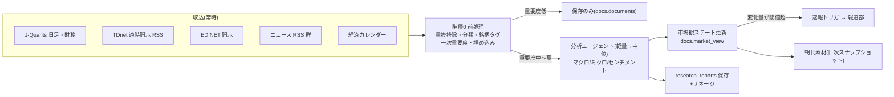

# リサーチ層+情報分析 詳細設計書 v1.0

- 作成日: 2026-08-03 / ステータス: ドラフト(ユーザーレビュー待ち)
- 上位文書: [00-system-design.md](00-system-design.md) §3(組織)・§8(研究制度 v2)、[10-data-accounting.md](10-data-accounting.md)(docs スキーマ)
- スコープ: ①データ取込(Phase 対象ソース)②階層0前処理 ③分析エージェント構成 ④市場観ステートの更新規約 ⑤反証拠テスト
- 稼働モデル: **常時稼働・増分処理**(v3.1 決定)。「新データ到着 → 前処理 → 関連エージェントの増分分析 → 市場観更新 → 閾値超で速報トリガ」がイベント駆動で流れる

## 1. 全体パイプライン



## 2. データ取込(初期スコープ)

| ソース | 内容 | 頻度 | 実装 |
|---|---|---|---|
| J-Quants API | 日本株 日足・財務・銘柄マスタ | 日次(夕方確定後) | Free プランで開始、必要時 Standard 化(予算承認) |
| TDnet RSS | 適時開示(決算・業績修正・材料) | 5分間隔ポーリング | 階層0 でルールマッチ(開示種別辞書) |
| EDINET API v2 | 有報・大量保有等 | 日次 | type=5 CSV 優先 |
| ニュース RSS | 主要メディアの公開 RSS 数本 | 15分間隔 | 本文はリンク先を取得できる範囲で(robots 尊重) |
| 経済カレンダー | 指標発表・決算予定 | 日次 | market.calendar_events(新設・§6)へ |
| SEC EDGAR / 海外 | 米国株本格化時 | — | 第2期(Reddit・5ch も第2期で情報分析班と設計) |

- 全取込は Run 経由(run_id)+as_of 付き+原文は証憑ストアへ。冪等(content_hash で重複排除)
- ソース停止検知: 各ソースに鮮度 SLA(例: TDnet 30分)を定義し、超過で `#運営` へアラート(監査 A-14 の常時部分)

## 3. 階層0 前処理(非LLM・限界費用ゼロ)

到着文書ごとに: ①重複排除(content_hash 完全一致+埋め込み近傍の準重複)②言語判定 ③**分類**(開示種別・ニュースカテゴリ: 辞書・正規表現+ロジスティック回帰/fastText、教師データは運用中に蓄積)④**銘柄・エンティティタグ**(銘柄コード辞書・社名辞書のマッチ)⑤**一次重要度スコア**(ルール: 開示種別の重み+対象銘柄の保有/ウォッチ状況+統計的異常の併発)⑥埋め込み生成(軽量埋め込みモデル)→ `docs.documents.meta` に格納。

重要度による振り分け: 低=保存のみ / 中=軽量 LLM トリアージへ / 高(重要開示・保有銘柄関連・異常併発)=直接 中位分析+速報候補。**分類・重要度の判定精度は監査 A-13 のサンプル検査対象**(誤分類の見逃しはここが最上流のため)。

## 4. 分析エージェント構成

各エージェントは「入力スキーマ・出力スキーマ・プロンプト資産・モデル階層」を固定した純関数的ジョブ。プロンプトは `personas/analyst-<name>/` にバージョン管理(変更は通常の PR ゲート)。

| エージェント | 担当 | 入力 | 出力(scores jsonb の主フィールド) |
|---|---|---|---|
| macro | 金利・為替・マクロ指標・中銀 | 新着マクロ文書群+現在の市場観 | regime 提案(資産クラス別)、金利/為替バイアス(-1〜+1)、根拠 refs |
| micro | 個別銘柄・決算・開示 | 銘柄タグ付き文書群+当該銘柄の保有/ウォッチ状況 | 銘柄別 impact(-1〜+1)、materiality(0-1)、催化剤種別、根拠 refs |
| sentiment | ニュース・(第2期: SNS)の集計的心理 | 前処理済み文書群の統計+サンプル本文 | センチメントスコア(資産クラス別・銘柄別)、異常度、根拠 refs |
| editor | 統合・矛盾検出 | 上記3系の新規出力+市場観 | 市場観の更新案(diff 形式)、矛盾フラグ、朝刊向けトピック候補 |

- **モデル階層**: トリアージ=軽量、本分析=中位。editor の市場観更新案の採否判定は決定論ルール(§5)。Fable は関与しない(週次の品質レビューのみ)
- **出力の下流契約**: 戦略・報道部は scores(構造化部分)だけに依存(v1 からの原則)。自由記述 body_md は人間向け
- 全出力に入力文書の doc_id 列挙(input_refs)必須 — リネージと監査 A-13 の前提

## 5. 市場観ステート(docs.market_view)の更新規約

「現在の市場観」は**単一の生きたステート**で、editor の更新案を決定論ルールで適用して更新する:

1. **更新はすべて diff**(regime の変更・key_risks の追加/確度変更/解消)。全 diff に根拠 refs 必須
2. **慣性ルール**: regime の反転(risk_on→risk_off 等)は「複数ソース・複数日にわたる証拠の蓄積」を要する(単一ニュースでの反転禁止 — 追従性・過敏性の抑制)。反転条件は宣言的な設定(閾値)で定義
3. **変化量スコア**: 各更新に magnitude(0-1)を算出(regime 反転=大、リスク確度の微調整=小)。**magnitude が閾値超 → 報道部の速報トリガ**(30-press-discord §3 の S2)
4. 日次スナップショット(朝刊素材・バックテスト用の point-in-time 市場観)。全履歴保持
5. **市場観の予測は検証可能に**: key_risks には可能な限り「観測可能な兆候(この指標がこうなったら確度を上げる/下げる)」を付記させ、月次で市場観の的中を後方検証(報道部 predictions と同思想)

## 6. スキーマ追加

```sql
CREATE TABLE market.calendar_events (
  event_id   bigint GENERATED ALWAYS AS IDENTITY PRIMARY KEY,
  event_type text NOT NULL,          -- indicator|earnings|policy|other
  title      text NOT NULL,
  scheduled_at timestamptz NOT NULL,
  instrument_id bigint,              -- 決算なら対象銘柄
  importance int NOT NULL DEFAULT 1, -- 1-3
  meta jsonb, as_of timestamptz NOT NULL, run_id bigint NOT NULL
);
-- watchlist(ユーザー+FM のウォッチ銘柄。前処理の重要度判定が参照)
CREATE TABLE market.watchlist (
  instrument_id bigint NOT NULL,
  added_by text NOT NULL,            -- 'owner' | FM 名
  reason text, added_at timestamptz NOT NULL,
  PRIMARY KEY (instrument_id, added_by)
);
```

## 7. 反証拠反転テスト(追従性の計測 — 監査 A-13)

- 月次で、実文書に合成した**反証拠セット**(現在の市場観と逆方向の証拠を段階量で混ぜたもの)を分析エージェントに通し、意見反転率カーブを計測する(明示的にテストであることはエージェントに知らせない)
- 期待挙動: 反証拠 20% で不動、50% で確度低下、80% で反転 — カーブが「固執」(反転しない)にも「過敏」(即反転)にも寄っていないかを監査レポート化
- プロンプト資産の改訂(PR)時は本テストを回帰テストとして必須実行

## 8. 実装タスク分割

| タスク | 内容 | 依存 |
|---|---|---|
| T-009 取込パイプライン | J-Quants/TDnet/EDINET/RSS/カレンダー+鮮度 SLA | T-001(済) |
| T-010 階層0前処理 | 重複排除・分類・タグ・重要度・埋め込み | T-009 |
| T-011 分析エージェント+市場観 | 4エージェント・更新規約・スナップショット | T-010 |
| (T-007/T-008 報道部) | 朝刊・速報 | T-011 |

T-009 は T-006(Bot)完了後すぐ発行可能。T-009〜T-011 が通ると「データ→分析→朝刊」の最初の運用可能版が成立し、第1回実装監査(#15)のトリガーになる。

## 9. コスト概算(経営管理部の予算科目へ)

- 階層0: ゼロ(CPU のみ)。埋め込み: 軽量モデルで月数百円規模
- 軽量トリアージ: 対象は重要度中以上のみ(想定 100〜300件/日)
- 中位分析: トリアージ通過分+重要イベント(想定 20〜60件/日)+朝刊執筆
- 初月は計測優先(ユニットエコノミクス台帳で実測 → 翌月予算で調整)

## 10. 未決事項

1. ニュース RSS の初期セット(私案: 日経系公開 RSS・Reuters・Bloomberg 公開分・日銀/財務省/FRB 公式)— ユーザーの好み(朝刊編集方針の回答)を反映して確定
2. ウォッチリスト初期値 — ユーザー回答待ち(無ければ政策ミックスの指数構成銘柄から機械生成)
