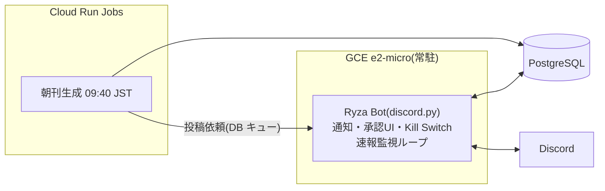
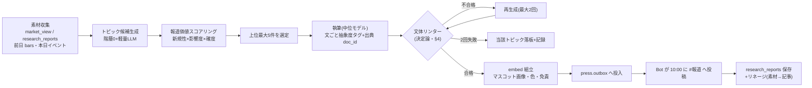
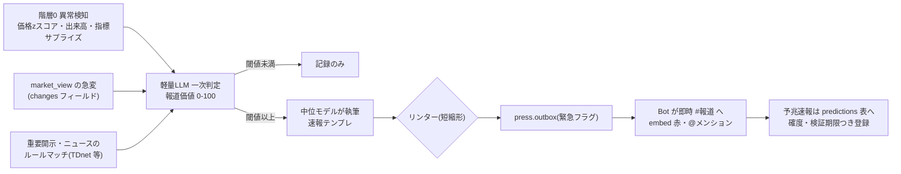

# 報道部+Discord Bot 詳細設計書 v1.0

- 作成日: 2026-08-03 / ステータス: ドラフト(ユーザーレビュー待ち)
- 上位文書: [00-system-design.md](00-system-design.md) §7(報道部)、[70-writing-standard.md](70-writing-standard.md)(Uneven U)
- スコープ: ①Ryza 本体 Discord Bot(GCE 常駐)②朝刊パイプライン ③速報エンジン ④文体リンター仕様

## 1. アーキテクチャと実装順序



**実装順序の設計判断**: Bot 基盤(T-006)は朝刊の素材(データ取込・リサーチ層)に依存しないため**先行実装**する。これにより (a) 承認 UI・Kill Switch・通知が早期に本番化し、(b) 開発ブリッジの単一障害点(Mac)が解消される(昨夜の障害の教訓)。朝刊・速報(T-007/T-008)はデータ取込+リサーチ層実装後。

- 投稿は Bot 経由に一元化(`press.outbox` テーブルをキューとし、Bot が配送・既送管理)。ジョブが直接 Discord API を叩かない(トークンの配置を Bot 1箇所に限定)
- チャンネル構成(2026-08-03 ユーザー指示で統合): **4チャンネル** — `#報道`(朝刊・速報・号外)/ `#承認`(ボタン操作)/ `#運営`(日報・経営・監査報告)/ `#dev`(開発対話 — 現行ブリッジの後継)
- **全チャンネルはカテゴリ `1533512287816782017` 配下に設置**。Bot が起動時に存在確認し、無ければ自動作成(ensure)。name→channel_id の解決結果は DB に記録(手動リネームに追従)

## 2. 朝刊パイプライン(毎朝 10:00 JST 投稿)



- **トピック選定**: 候補は「market_view の変化点・research_reports の高スコア項目・カレンダーイベント(指標発表・決算)」から生成し、報道価値 = 新規性(既報との埋め込み距離)× 影響度(対象資産の保有・ウォッチ状況)× 確度(ソース数・一次情報か)で採点。**採点根拠も保存**(監査可能性)
- **構成**: トピック(最大5、各200〜400字)→ 本日の注目(イベント表)→ ポートフォリオ概況(NAV・前日比 — ファンド会計部の確定値のみ使用、provisional なら「暫定」明記)
- **編集方針(2026-08-03 ユーザー決定)**: ①**全トピックに「取引への含意」フィールドを必須化** — 推奨アクション(ロング/ショート/ウォッチ追加/様子見)+対象+条件を明記し、リンターで欠落を拒否(L-7)。「読んで面白い」より「どう動けばいいか分かる」を優先 ②**政策・地政学の定常枠**を設ける(報道価値スコアで政策・地政学カテゴリに加点)
- 生成開始 09:40 JST(20分バッファ)。リンター2回失敗のトピックは落として次点繰上げ、失敗原文は研究素材として保存

## 3. 速報エンジン(常駐監視)



- **速報①(事実)**: 発生済みイベント。テンプレ: アーギュメント一文 → レベル1根拠列挙(出典必須)→ レベル5含意一文
- **速報②(予兆)**: 複数の弱いシグナルの同方向一致。**必ず「予測」ラベル+確度%+根拠+検証期限**を付け、`press.predictions` に登録。期限到来時に的中判定を自動実施し、的中率は報道部の品質指標として月次報告(外れの隠蔽を構造的に防ぐ)
- **抑制**: 同一トピックの重複速報は埋め込み類似度で抑止。時間あたり上限(初期値: 3本/時、12本/日)— 超過時は「まとめ速報」に統合。閾値・上限は config で調整可能
- 監視は GCE 常駐プロセス内ループ(場中 1〜5分間隔、階層0なので限界費用ゼロ)

## 4. 文体リンター仕様(決定論)

入力: 執筆モデルの構造化出力 `{topics: [{argument, sentences: [{text, level(1-5), source_ids[]}]}]}`

| 検査 | 規則 | 不合格時 |
|---|---|---|
| L-1 アーギュメント | トピック先頭に level=5 相当の一文(argument フィールド)が存在し、本文と重複しない | 再生成 |
| L-2 U字形状 | 本文の level 系列が「非増加区間 → 谷(level 1 または 2 を最低1文含む)→ 非減少区間」の単谷形。開始 level ≥3、末尾 level = 5 | 再生成 |
| L-3 分量 | トピックあたり 200〜400字(空白除く)、文数 4〜8 | 再生成 |
| L-4 出典 | level 1 の全文に source_ids ≥1(doc_id / bars 参照)。存在しない ID は不合格 | 再生成 |
| L-5 予測ラベル | 速報②で「確度・検証期限」フィールド欠落を拒否 | 再生成 |
| L-6 タグ整合(抜取) | 軽量LLM が抽象度タグの妥当性を抜取検査(タグ偽装の検出)。不一致率>20% で警告 | 警告+週次レビューへ |
| L-7 取引含意 | 朝刊の全トピックに trade_implication(action/対象/条件)が存在 | 再生成 |

- U字判定アルゴリズム: `levels` 配列に対し ①min 値が {1,2} に含まれる ②min の最初の出現位置より前が非増加・後が非減少 ③先頭≥3 ④末尾=5。理想形 4→3→2→1→3→5 を含む一般形
- リンター自体は純関数(LLM 不使用)でユニットテスト対象。L-6 のみ軽量LLM(タグの自己申告を信用しない防御)

## 5. Discord Bot 基盤(T-006 で先行実装)

- **discord.py 2.6 / GCE 常駐**(systemd で自動再起動)。トークンは Secret Manager から起動時ロード
- **通知配送**: `press.outbox`(id, channel, content/embed_json, urgent, sent_at)をポーリング(通常5秒)し配送。配送記録で二重送信防止
- **承認 UI**: 提案(PR・戦略昇格・ブレーカー復帰・予算)を `#承認` にボタン付き embed で投稿 → 承認/却下/質問 → 結果を `governance.decisions` に記録(押下者がオーナー ID か検証)。質問はスレッドを開き担当エージェントへキュー
- **Kill Switch**: `/kill` コマンド(オーナーのみ)→ DB のフラグを立て、全発注経路が参照。復帰は `/resume` +確認ボタン2段階
- **日報**: 会計・リスクの確定値を 18:00 JST に `#運営` へ(データが無い間は稼働状況のみ)
- **失敗時**: Bot 死活は Cloud Monitoring の uptime check(プロセスメトリクス)+ Scheduler の朝刊ジョブ側からの疎通確認で検知し、`#運営` へ(Bot 死亡時はメール fallback)

## 6. マスコット・表現仕様

- embed 色: 通常 `#5B54C7`(紫)/ 速報 `#C24E3A`(赤)/ 承認 `#2E7D5B`(緑)。ただし朝刊は発信者キャラクターの色(`config/org.yaml`)を用いる(2026-08-03 代表指示。速報の赤=緊急度シグナルは維持)
- **発信者表示(2026-08-03 代表指示)**: 全対話面でキャラクターが「名前(役職)」+アイコンを名乗る。台帳は `config/org.yaml`(正)、共通ローダは `src/ryza/org.py`。配送はチャンネルごとの webhook `ryza-org` で username/avatar_url を投稿ごとに設定(`src/ryza/bot/webhooks.py`)。webhook を確保できない場合は embed author 方式へ自動フォールバック
- **キャラクター設定(2026-08-03 ユーザー決定)**: 報道部の人格は**岩倉玲音**(serial experiments lain)。人格・口調はクロール調査に基づき `personas/press-lain/` の charter+口調ガイドとして整備し、執筆プロンプトに注入する(執筆規格の U字構造は維持 — 人格は口調・語り口にのみ作用)
- **画像(2026-08-03 ユーザー決定)**: 毎回ネットから取得。**AI 生成画像は除外**(ユーザー指示)。実装: 画像ボード API(safebooru 等)をタグ検索 — 玲音の投稿画像は `iwakura_lain` 系タグ、記事サムネイルは「かわいい任意のキャラクター」を curated タグリストからランダム選択。共通規則: ① `ai_generated` 等の AI 生成系タグを除外条件に ②再アップロードせず URL 参照 ③出典・アーティストを embed footer にクレジット ④取得失敗時は画像なしで投稿 ⑤完全非公開サーバー限定運用(公開範囲フラグと連動)。著作権はユーザーが非公開利用として許容する判断(2026-08-03)
- 免責フッター(全投稿): 「本投稿は自己運用システムの内部記録であり投資助言ではない」+ 完全非公開サーバー前提のため個別銘柄推奨は許可(00-system-design §7)
- 文体: 執筆規格(70-writing-standard.md)準拠。週次で Fable が文体レビュー(サンプル添削 → プロンプト資産更新提案)

## 7. スキーマ追加(press)

```sql
CREATE TABLE press.outbox (
  id bigint GENERATED ALWAYS AS IDENTITY PRIMARY KEY,
  channel text NOT NULL,             -- press|approval|ops|dev(2026-08-03 統合)
  embed_json jsonb NOT NULL,
  urgent boolean NOT NULL DEFAULT false,
  created_at timestamptz NOT NULL,
  sent_at timestamptz,               -- NULL=未送
  run_id bigint NOT NULL
);
CREATE TABLE press.predictions (
  id bigint GENERATED ALWAYS AS IDENTITY PRIMARY KEY,
  report_id bigint NOT NULL,         -- 元の速報②
  claim text NOT NULL,
  confidence numeric NOT NULL,       -- 0-1
  verify_by timestamptz NOT NULL,    -- 検証期限
  outcome text,                      -- pending|hit|miss|void
  verified_at timestamptz
);
```

`governance.decisions`(承認記録)は 05-governance の議事録スキーマ実装(別タスク)と共通化する。

## 8. 実装タスク分割

| タスク | 内容 | 依存 |
|---|---|---|
| **T-006 Bot 基盤** | 常駐 Bot・outbox 配送・承認 UI・Kill Switch・日報骨格・press スキーマ | なし(**即着手可**) |
| T-007 朝刊パイプライン | トピック選定・執筆・リンター・embed | データ取込+リサーチ層 |
| T-008 速報エンジン | 異常検知・一次判定・予兆 predictions | 同上 |

## 9. 決定事項(2026-08-03 ユーザー決定)

1. マスコット: 外部 API から毎回取得(§6 に反映済み)
2. チャンネル: 4つに統合し、カテゴリ `1533512287816782017` 配下に自動設置(§1 に反映済み)
